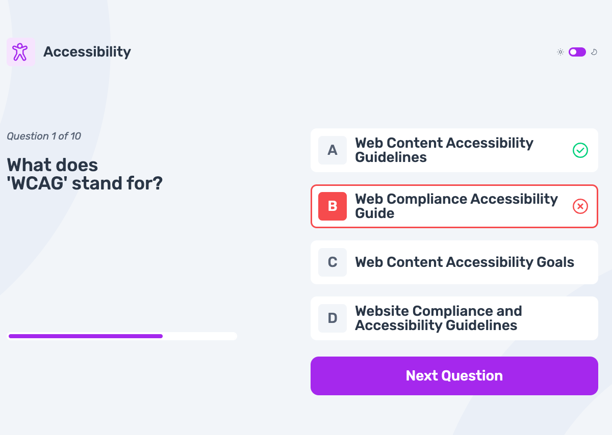
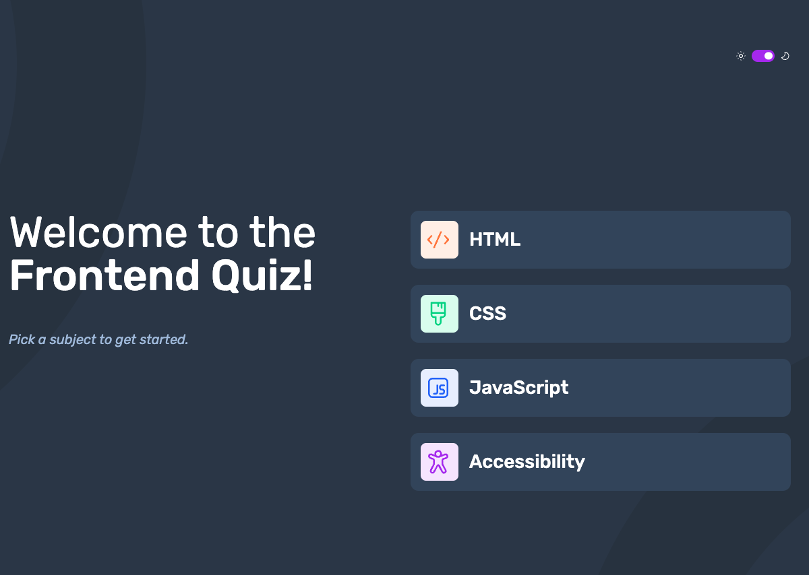

# Frontend Mentor - Frontend quiz app solution

This is a solution to the [Frontend quiz app challenge on Frontend Mentor](https://www.frontendmentor.io/challenges/frontend-quiz-app-BE7xkzXQnU).

## Table of contents

- [Overview](#overview)
  - [The challenge](#the-challenge)
  - [Screenshot](#screenshot)
  - [Links](#links)
- [My process](#my-process)
  - [Built with](#built-with)
  - [What I learned](#what-i-learned)
  - [Useful resources](#useful-resources)
- [Author](#author)

## Overview

### The challenge

Users should be able to:

- Select a quiz subject
- Select a single answer from each question from a choice of four
- See an error message when trying to submit an answer without making a selection
- See if they have made a correct or incorrect choice when they submit an answer
- Move on to the next question after seeing the question result
- See a completed state with the score after the final question
- Play again to choose another subject
- View the optimal layout for the interface depending on their device's screen size
- See hover and focus states for all interactive elements on the page
- **Bonus**: Change the app's theme between light and dark

### Screenshot

<table align="center">
  <tr>
    <td></td>
    <td></td>
  </tr>
  <tr align="center">
    <td>Light Mode</td>
    <td>Dark Mode</td>
  </tr>
</table>

### Links

- Solution URL: [Link](https://github.com/a-d14/quiz-app-frontend-mentor)
- Live Site URL: [Link](https://a-d14.github.io/quiz-app-frontend-mentor)

## My process

### Built with

- Semantic HTML5 markup
- CSS custom properties
- Flexbox
- CSS Grid
- Mobile-first workflow
- JS Template Literals

### What I learned
- Styling ```<progress>``` element for firefox and chromium based browsers.
- Creating a toggle button using a checkbox input element.
- Switching between light and dark mode using CSS and JS.

### Useful resources

- [Styling Progress Bar](https://css-tricks.com/html5-progress-element)
- [Creating Toggle Button](https://alvaromontoro.com/blog/68017/creating-a-css-only-toggle-switch)

## Author
- Frontend Mentor - [@a-d14](https://www.frontendmentor.io/profile/a-d14)
